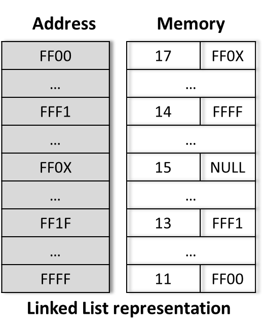

# Data Structure AIUB Slides
## Data & Structures :
#### Data :
* Row of information than can be processed to get results.

#### Structure :
* Some elementory items constitute a unit and that unit may be considered as a structure.
* A structure may be treated as a frame where we organise some elementory intems in different ways.

#### Data Structure :
* Data structure is a sturcture where we organize elementory data items in different ways and there exits structural amon the items so that it can be used efficiently.
* In other words , a data sturcture is means of sturctural relationship of elementory data itmes for storing retrieving data in computer's memory.

#### Elements of a Data Structure :
* Usually elementory data items are the elements of a Data Structure.
* Types of data items : char , int , float etc
* A Data Structure may be an element of another data structure. That means a data structure may contain another data structure. For exmaple : Array , Structure , Stact etc.
* Study Data Structure in two ways :
    * **Basic :** Habing a concrete implementation . Example : Variable , Pointer, Array etc.
    * **Abstact Data Types(ADTs) :** ADTs are entities that are difination of data and operation but do not have any concrete implementation. Example : List , Stack , Queue etc.

### Operation on Data Structures :
#### Basic :
* Insertion (addition fo a new element in the data structure)
* Deletion (removal of the element from the data structure)
* Traversal (accessing data elements in the data structure)

#### Additional :
* Searching (Loacation a certain element in the data structure)
* Sorting (Arranging elements in a data structure in a simplifiead order)
* Merging (Combining element of two simlar data structure) etc.

### Algorithm :
* Set of instructions that can be followed to perform a task. In other words, sequence of steps that can be followed to solve a problem.
* Each and every algorithm can be divided into three sections :
    * **Inplut :**  Where we show which data elements are to be given or fed to the algorithm as in input.
    * **Operational or Processing section :** Here we have to do all necessary operation , such as computation , taking decision , calling other procedures(or algorithms) etc.
    * **Output :** Where we display or get the result with the help of input and processing.

### Program :
* Secuence of **insturctions of any programming language** that can be followed to perform **a particular task.**
* Like an algorithm , generally a program has three sections as **Input** , **Processing** , **Output**.
* For particular problem (usually for a complex problem) , at first we may write an algorithm. Later , the algorithm amy be corverted into a program.
* In a program usually we use a large ammount of data. Most of case these data are not elementory items, where exists structural reletionship between elementory data items.
    * That means the program uses data structures.


### Data Storage Concept
#### Variable :
* A variable is a storage locatioin an associated symbolic name (an identifier) which contains some known or unknown quantity or information , a value.
* The variable name is the usual way to reference the stored value; this separation of name and content allows the name to be used independently of the axact information it represents.
* The identifier in computer source code can be bound to a value during run time, and the value of the variable may thus change during the course of program execution.
* In computing , a variable may be employed in a repetitive process : assigned a value in one place , than used elsewhere , then reassigned a new value and used again in the same way.
* Compilers have to replace variable's symbolic names with the actual loactions of the data in the memeory.

#### Memory Management :
* A variable in an memory that has been given a name.
* The computer access it's own memory not by using variable names but by using a memeory map with each location of memory uniquely defined by a number , called the address of that memory loaction.
* To access the memory of a variable the program uses the & operator. For Example : &x returns the address of a variable x.
```c++
int x = 10;
cout << x << endl;      // int value 
cout << &x << endl;     // address of x
```
## Array [1 - Dimenstional]
* An array can hole a **series of elements** of the **same type** placed in contiguous memeory locations.
* Each of these elements can be individually referenced by using index to unique identifier.
* In other words , array are a conveninent way of grouping a lot of values of same type under a single variable name.

#### Declearation :
* Like a regular variable , an array must be declared before it is used. A typical declaration for an array in C++ is :
```c++
// type name [total_number_of_element];
int arr[10];
```

#### Initialization :
* Array elements will not be initialized to any value by default, so their content will be undeterminded until we store some value in them. The elements of global and static array are automatically initialized with their default values, zeros.
* We can initialize as like :

```c++
int arr[5] = {16 , 2 , 77 , 40 , 138};
// index       0   1   2    3     4
```
The number of value in { } must not be larger than the number of element in [ ]

* We can initalize char arry by stirng :
```c++
int arr = ['a' , 'e' , 'i' , 'o' , 'u' , '\0'];    // char arry
string arr2 = "aeiou";  // will work as like arr
```


#### Access :
* We can access value as like : arrayName[index]

#### Searching an element in Array : (Linear Search)
```c++
int mimo[10] = {32,4,5,12,5,54,6,23,3,5}; // declaration of a new array
int n;
cout<<“Enter the number to be searched: “<<endl;
cin>>n; // inputting the number to be searched in the array
for(int i=0; i<10; i++){ // searching begins
	if (n == mimo[i]){
	  break; // searching ends
	}
 }
 cout<< n << "Was found in index "<< i << " of the array." << endl;
```


#### Array Insertion - Static array :
```c++
void insertAt(int arr[], int& size, int max_size, int element, int position) {
    // Check if there's room in the array
    if (size >= max_size) {
        cout << "Array is full, cannot insert new element." << endl;
        return;
    }

    // Check if the position is within bounds
    if (position < 0 || position > size) {
        cout << "Invalid position!" << endl;
        return;
    }

    // Shift elements to the right to make room for the new element
    for (int i = size; i > position; i--) {
        arr[i] = arr[i - 1];
    }

    // Insert the new element
    arr[position] = element;

    // Increase the size
    size++;
}
```


#### Array Insertion - Dynamic Array :
```c++
void insertAt(vector<int>& vec, int element, int position) {
    // Check if the position is within bounds
    if (position < 0 || position > vec.size()) {
        cout << "Invalid position!" << endl;
        return;
    }

    // Use the insert method to insert the element
    vec.insert(vec.begin() + position, element);
}
```

#### Array Deletion - Static Array
```c++
void deleteAt(int arr[], int& size, int position) {
    // Check if the position is within bounds
    if (position < 0 || position >= size) {
        cout << "Invalid position!" << endl;
        return;
    }

    // Shift elements to the left to fill the gap
    for (int i = position; i < size - 1; i++) {
        arr[i] = arr[i + 1];
    }

    // Decrease the size
    size--;
}
```


#### Array Deletion - Dynamic Array
```c++
void deleteAt(vector<int>& vec, int position) {
    // Check if the position is within bounds
    if (position < 0 || position >= vec.size()) {
        cout << "Invalid position!" << endl;
        return;
    }

    // Use the erase method to remove the element
    vec.erase(vec.begin() + position);
}
```


## Array [2 - Dimensional]
* 2D arrays can be decribed as "Arrays of arrays". It can be imagined as Matrix.
```c++
int matrix[3][4] = {    // row 3, column 4
        {1, 2, 3, 4},   // row index 0
        {5, 6, 7, 8},   
        {9, 10, 11, 12}
        };
```
* 1st Dimension is considered as row and the 2nd Dimension is column. Hear, We have 3 row , 4 column.


#### Initialization :
* Declearation 2D array can be one of the following ways :
```c++
int arr[3][5] = {1,2,3,4,5,2,4,6,8,10,3,6,9,12,15};
int arr[3][5] = {{1,2,3,4,5},{2,4,6,8,10},{3,6,9,12,15}};
int arr[3][5] =  {
  {1,2,3,4,5},
  {2,4,6,8,10},
  {3,6,9,12,15}
};
```
* The internal braces are unnecessary , but helps to distinguish the rows from the columns. 

* Take care to include the semicolon at the end of the curly brace which closses the assignment.

* If there are not enough element in the curly braces to account for every single element in an array , the remaining elements will be filled out with garbage/zeros.

* Static and global variables are always guaranteed to be initialized to zero anyway , whereas auto or local varibales are guaranteed to be garbage.

#### 2D Array Input :
```c++
int row = 3, col = 4;
int arr[row][col];
for (int i = 0; i < row; i++)                 
{
    for (int j = 0; j < col; j++)
    {
        cin >> arr[i][j]; 
    }   
}
```

#### 2D Arry Output :
```c++
int row = 3, col = 4;
int arr[row][col];
for (int i = 0; i < row; i++)                 
{
    for (int j = 0; j < col; j++)
    {
        cout << arr[i][j] << " " << endl; 
    }   
    cout << endl;
}
```

#### 2D Array Memory Access :
* As memory is flat, in 2D array the values actually stored sequentially in the memory (just like 1D array). 
* Memory of each element of an array can be accessed using the & Operator. Ex : &arr[2] --> address of index 2 element.
* If the element is more than a byte. It gives the starting byte of the element.
* The name of an array alway refer to the starting location of the array. so , arr == arr[0]

* For any array arr[r][c];
    * arr[i] = &arr[i][0]; represents the starting address of ith row.

* A 2D Array is also referred as an array of arrays. An array which each element is another array.


## String :
* Srings are sequence of characters representing a piece of text. In programming langulage a string is represented as some characters enclosed by double quotes. "This is a string".
* A string is mainly declared using an array of characteres.
* Difference between a simple array of character and an array of character representing string is the end maker given at the and of the string. This is '\0' . NULL

#### Declaration & Initialization :
* Declaration of a string is just an array of char : char arr[5];
* But things are different, when we initiazie during declaraton. An array to contain 5 char values (H , e , l , l , o) of type char called arr could be represented like this : 
```c++
char mimo [5]={ 'H', 'e', 'l', 'l', 'o'};
```
* But, to represent the same text in c/c++ double quotaton ("") is used to bound the text. And , a NULL character is added at the end of the text. So, Bacause of this NULL , we need to declare an aditional slot in the array. 

```c++
char mimo [6]= "Hello";
```
* The standard library functions can recognize NULL ('\0') as being the end of the string.

#### Access , Input , Output :


```c++
string str; // Declare a string variable named 'str'

// Prompt the user for input
cout << "Enter a string: ";
getline(cin, str); // Read a line of input and store it in 'str'

// Accessing the string and performing some operation (e.g., converting to uppercase)
string output = str; // Copying 'str' to 'output' (just an example)

// Display the output
cout << "You entered: " << output << endl;
```


### String Handling Functions :
```c++
#include <cstring>
```
#### strlen( ) :

```c++
char str = "Hello, World!";
cout << "The length of the string is: " << strlen(str) << endl;
```
#### strcpy( ) :
```c++
char source = "Hello, World!";
char destination[50]; // Ensure this array is large enough to hold the copied string

strcpy(destination, source); // Copy the string
cout << "The copied string is: " << destination << endl;
```

#### strcat( ) :
```c++
char destination[50] = "Hello"; // Ensure this array is large enough for concatenation
const char* source = ", World!";

strcat(destination, source); // Concatenate the strings
cout << "The concatenated string is: " << destination << endl;
```

#### strcmp( ) :

```c++
char str1 = "Hello";
char str2 = "World";

int result = strcmp(str1, str2); // Compare the strings
if (result == 0) {
    cout << "The strings are equal." << endl;
} else if (result < 0) {
    cout << str1 << " is less than " << str2 << endl;
} else {
    cout << str1 << " is greater than " << str2 << endl;
}
```

### String as Object :
* Unlike char arrays, there is not fixed length for string objects. it can be used as per the requrement of the progrrammer.
* Unlike a string that is a character array , a string object does not have NULL char at the end of it.
* Instead of using **cin** or **cin.get( )** functions for accepting strings with white spaces as input, we can use **getline( )** function 
* getline( ) function takes the input stream as the first parameter which is cin and string object as the second parameter.
* To use library functions fo "cstring" on a string object , it need to be converted to a string of char array with a NULL char at the end.

```c++
string line;
cout << "Please enter a line of text: ";
getline(cin, line); // Reads a line from standard input

cout << "You entered: " << line << endl;
```

## Pointer :
* The computer access it's own memory not by using variable names but by using a memory map where each loaction  of memory is uniquely defined by a number, called the address. Pointers are a very powerful, but primitive facility to avail that address. 
* A variable is an area of memory that has been given a name. For example : 
    * int x; is an area of memory that has been given the name x.
    * The instruction x = 10; stores athe data value 10 in the area of memory named x.
    * The instruction &x returns the address of the location of variable x.
* A pointer is a variable that **stores the location of a memory/variable**. A pointer has to be declared. For example :
    * int *p; 
    * Adding the asterisk (called the de-referncing operator) in front of a variable's name declares it to be a pointer to the declared type
    * It can store address of the memory of declare type varible.
    * int *p , q; Declares **p a pointer to int** and **q an int** and the instruction p = &q; stores the address of q in p; so, p in pointing at q
* After declaring a pinter *p variable, it can be used like any other varible :
    * p stores the address/pointer to another varibale.
    * &p gives the address of the pointer variable.
    * *p is the value stored in the variable that p points at.

```c++
 int a = 10;       // A regular integer variable
int *p = &a;      // A pointer variable that holds the address of 'a'

// Display the value of 'a'
cout << "The value of a: " << a << endl;

// Display the address of 'a'
cout << "The address of a (&a): " << &a << endl;

// Display the value stored in the pointer 'p' (which is the address of 'a')
cout << "The value of pointer p (address of a): " << p << endl;

// Display the value pointed to by 'p' (which is the value of 'a')
cout << "The value pointed to by p (*p): " << *p << endl;

// Modify the value of 'a' using the pointer 'p'
*p = 20;

// Display the new value of 'a' after modification
cout << "The new value of a after modification through pointer p: " << a << endl;
```

### Pointer & Array :
An array is simply a block of memory. An array can be accessed with pointers as well as with [ ] squre brackets. The name of an array variable is a pointer to the first element in the array. So, any operation that can be achieved by array subcripting can be also be done with pointers or vice-versa(in the other way).
```c++
void main( void )
{
 float r[5] = {22.5,34.8,46.8,59.1,68.3};
 cout <<"1st element: "<< r[0] <<"\n";  // Output: 1st element: 22.5
 cout <<"1st element: "<< *r <<"\n";    // Output: 1st element: 22.5
 cout <<"3rd element: "<< r[2] <<"\n";  // Output: 3rd element: 46.8
 cout <<"3rd element: "<< *(r+2)<<"\n"; // Output: 3rd element: 46.8
 float *p;
 p = r; //&r[0]
 cout <<"1st element: "<< p[0] <<"\n";  // Output: 1st element: 22.5
 cout <<"1st element: "<< *p <<"\n";    // Output: 1st element: 22.5
 cout <<"3rd element: "<< p[2]<<"\n";   // Output: 3rd element: 46.8
 cout <<"3rd element: "<< *(p+2)<<"\n"; // Output: 3rd element: 46.8
 for(int i=0; i<5; i++, p++)
  cout <<"Element "<<(i+1)<<" is: "<<*p<<"\n"; 
 /*
 Output of the loop:
 Element 1 is: 22.5
 Element 2 is: 34.8
 Element 3 is: 46.8
 Element 4 is: 59.1
 Element 5 is: 68.3
 */
}
```
* Array pointers are different. Array return the address of index 0;

```c++
#include <iostream>

using namespace std;

int main() {
    // Initializing an array of integers
    int arr[] = {10, 20, 30, 40, 50};
    int n = sizeof(arr) / sizeof(arr[0]); // Determine the number of elements in the array

    // Pointer to the first element of the array
    int *ptr = arr;

    cout << "Array elements using pointer arithmetic:\n";
    for (int i = 0; i < n; ++i) {
        cout << "*(ptr + " << i << ") = " << *(ptr + i) << "\n";
    }

    cout << "\nArray elements using array indexing:\n";
    for (int i = 0; i < n; ++i) {
        cout << "arr[" << i << "] = " << arr[i] << "\n";
    }

    cout << "\nPointer to array elements using array-like indexing:\n";
    for (int i = 0; i < n; ++i) {
        cout << "ptr[" << i << "] = " << ptr[i] << "\n";
    }

    cout << "\nComparing array name and pointer:\n";
    cout << "Address held by arr (array name) = " << arr << "\n";
    cout << "Address held by ptr (pointer) = " << ptr << "\n";

    cout << "\nIncrementing pointer to access each array element:\n";
    for (int i = 0; i < n; ++i) {
        cout << "*ptr = " << *ptr << "\n";
        ++ptr; // Move to the next element in the array
    }

    return 0;
}
```


#### Void pointer :
* The **void** type of pinter is special type of pointer which represents the absence of type. So **void** pointers are pointers that point to a value that has no type(and thus also an undetermined dereference properties).
* This allows void pointers to point to any data type **int , float , char , doube etc**
* But the data pointed by them cannot be directly de-referenced , since we have no type to de-reference to.
* So, need to cast the address in the void pointer to some other pointer type that points to a concrete data type before dereferencing it.
```c++
#include <iostream>
using namespace std;

// Function to increase the value of data based on its size
void increase(void *data, int psize){
  // Check if data is of type char
  if ( psize == sizeof(char) ){ 
     char *pchar; 
     pchar = (char*)data; 
     ++(*pchar); // Increase the value of the char by 1
  }
  // Check if data is of type int
  else if (psize == sizeof(int)){ 
     int *pint; 
     pint = (int*)data; 
     ++(*pint); // Increase the value of the int by 1
  }
}

void main (void){
  char a = 'x';
  int b = 1602;
  increase(&a, sizeof(a)); // Increment char variable 'a'
  increase(&b, sizeof(b)); // Increment int variable 'b'
  cout << a << ", " << b << endl; // Output the incremented values
}
```


#### Null Pointer :
* A NULL pointer is a regualr pointer of any pointer type which has specific value that indicates that it is not pointing to any valid reference or memory address. This value is the result of type-casting the integer value zero to any pointer type.
```c++
int * p;
p = 0;  //can also write, p = NULL;   
/* p has a null pointer value */
```
* A null pointer is a value that any pointer may take to represent that it is pointing to "nowhere" , while a void pointer is a specific type that can point to somewhere without a specific type.
* One refers to the value stored in the pointer itself and the other type of data it points to.

### Dynamic Memory Allocation :
* The exact size of array is unknown until the compile time, when a compiler compiles code written in a programming language into an executable form. The size of array declared initially can be sometimes insufficient and sometimes more than requred. 
* Dynamaic memory allocation allows a program to obtain more memory space , while running or to release space is requred.
* C++ integrates the operators **new** and **delete** for **dynamic memory allocation**.

* In order to request dynamic memeory we use the operator **new** data specifier. If a sequence of more than one memory block is requred, the data type specifier is folowed by the number of those memory blocks within brackets [ ]. It returns a pointer to the begining if the new block of memroy alocated.

**Syntex :**
```c++
// New Keyword
int *p = new int(100);  // create a daynamic int 1 variable
int *arr = new int[10]; // create a 10 size dynamic array

// Delete Keyword
delete p;       // Frre memory for p (single element)
delete [] *arr; // Free memory for arr  (array)
```

### Pointer and function :
* Pointer arguments enable of a function to access and change objects in the funtion that called it. This called **Call By Reference** function
```c++
#include <iostream>
using namespace std;

// Function to swap two integers using call by reference
void swap(int &a, int &b) {
    int temp = a;
    a = b;
    b = temp;
}

int main() {
    int x = 10;
    int y = 20;
    
    cout << "Before swap: x = " << x << ", y = " << y << endl;

    // Calling the swap function
    swap(x, y);

    cout << "After swap: x = " << x << ", y = " << y << endl;

    return 0;
}
```


#### Poiners in array function :
* Array return the address of 1st element(index 0); so, it will work as **call by reference** function. It will cange orignal value.
```c++
#include <iostream>

using namespace std;

// Function to swap two elements in an array using call by reference
void swap(int &a, int &b) {
    int temp = a;
    a = b;
    b = temp;
}

// Function to print the array
void printArray(const int arr[], int size) {
    for (int i = 0; i < size; i++) {
        cout << arr[i] << " ";
    }
    cout << endl;
}

int main() {
    int arr[] = {10, 20, 30, 40, 50};
    int size = sizeof(arr) / sizeof(arr[0]);

    cout << "Array before swap: ";
    printArray(arr, size);
    // Output: Array before swap: 10 20 30 40 50 

    // Swap elements at index 1 and index 3
    swap(arr[1], arr[3]);

    cout << "Array after swap: ";
    printArray(arr, size);
    // Output: Array after swap: 10 40 30 20 50 

    return 0;
}
```


#### Array Pointers & Initialization :
```c++
int arr[5] = {10, 20, 30, 40, 50};
int *ptr = arr; // ptr now points to the first element of arr

cout << "Array elements using pointer:" << endl;
for (int i = 0; i < 5; ++i) {
    cout << *(ptr + i) << " "; // Accessing elements using pointer arithmetic
}
cout << endl;
```


## Structure :
* Stores multiple type data under a variable;
* A Structure is an aggregate data type built using elements of others types.
#### Defining structure in C++ :

```c++
// Declare a structure named "car"
struct car {
  string brand;
  string model;
  int year;
};

int main() {
  // Create a car structure and store it in myCar1;
  car myCar1;
  myCar1.brand = "BMW";
  myCar1.model = "X5";
  myCar1.year = 1999;

  // Create another car structure and store it in myCar2;
  car myCar2;
  myCar2.brand = "Ford";
  myCar2.model = "Mustang";
  myCar2.year = 1969;
 
  // Print the structure members
  cout << myCar1.brand << " " << myCar1.model << " " << myCar1.year << "\n";
  cout << myCar2.brand << " " << myCar2.model << " " << myCar2.year << "\n";
 
  return 0;
}
```


## Sorting :

### Bubble Sort :
* **Initialize**: Start from the beginning of the list.
* **Compare**: Compare the current element with the next element.
* **Swap**: If the current element is greater than the next element, swap them.
* **Repeat**: Move to the next element and repeat the comparison and swap steps until the end of the list.
* **Pass Through**: Each complete pass through the list moves the largest element to its correct position.
* **Loop**: Repeat the process for the remaining unsorted part of the list until no swaps are needed.


```c++
// Function to perform bubble sort
void bubbleSort(vector<int>& arr, int n) {
    // Traverse through all array elements
    for(int i = 1; i < n; i++) {
        // Last i elements are already in place, so the inner loop will run from 0 to n-i-1
        for(int j = 0; j < n - i; j++) {
            // Swap if the element found is greater than the next element
            if(arr[j] > arr[j+1]) {
                swap(arr[j], arr[j+1]);
            }
        }
    }
}
```


### Selection Sort : 
* **Initialize**: Start with the first element as the current minimum.
* **Find Minimum**: Scan the rest of the list to find the actual minimum element.
* **Swap**: Swap the found minimum element with the first element.
* **Repeat**: Move the boundary of the sorted sublist one element to the right.
* **Loop**: Repeat the process for the remaining unsorted part of the list

```c++
void selectionSort(vector<int>& arr, int n)
{   
    for(int i = 0; i < (n-1); i++){
        int minIndex = i;

        for(int j = i+1; j < n ; j++){
            if(arr[j] < arr[minIndex]){
                minIndex = j;
            }
        }
        swap(arr[minIndex] , arr[i]);
    }
}
```


## Binary Search : 
Dividing the search interval in half, comparing the target value to the middle element, and adjusting the interval based on the comparison.
```c++
// Finding the key index in the sorted array
int findElementInSortedArray(int arr[] , int size , int key){
    int start = 0;
    int end = size - 1;
    int mid = (start + end)/2;

    while (start <= end)
    {
        // Check the middle point is quals to key or not
        if (arr[mid] == key)
        {
            return mid;
        }
        
        // Moving right side
        if (key > arr[mid])
        {
            start = mid + 1;
        }
        // Movieng Left Side
        else if (key < arr[mid])
        {
            end = mid - 1;
        }
        mid = start + (end-start)/2;
    }
    return -1;
}
```


## Linked List :
* Linked list is a data structure consisting of a group of memory space which together represent a list.(sequence of data).
* Each data is stored in a separate memory space/block(call cell/node).
* Each memory block contains the data along with link/location/address to the memory location for the next data in the list.
* A sequence of data can also be represented as an array. But in an array, data are stored consecutively in the memory. But , **Linkded list data are not stored consecutively in the mrmory**.


#### Application of linked list : 
```c++

```


```c++

```


```c++

```


```c++

```


```c++

```


```c++

```


```c++

```


```c++

```


```c++

```


```c++

```


```c++

```


```c++

```


```c++

```


```c++

```


