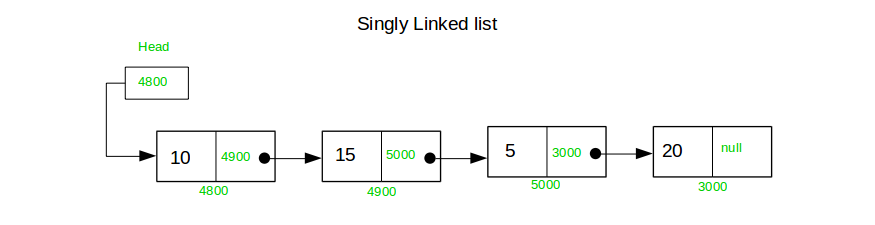
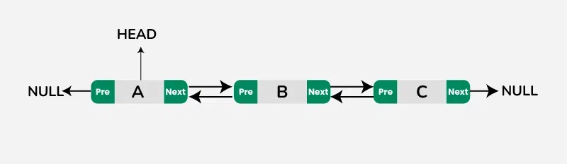
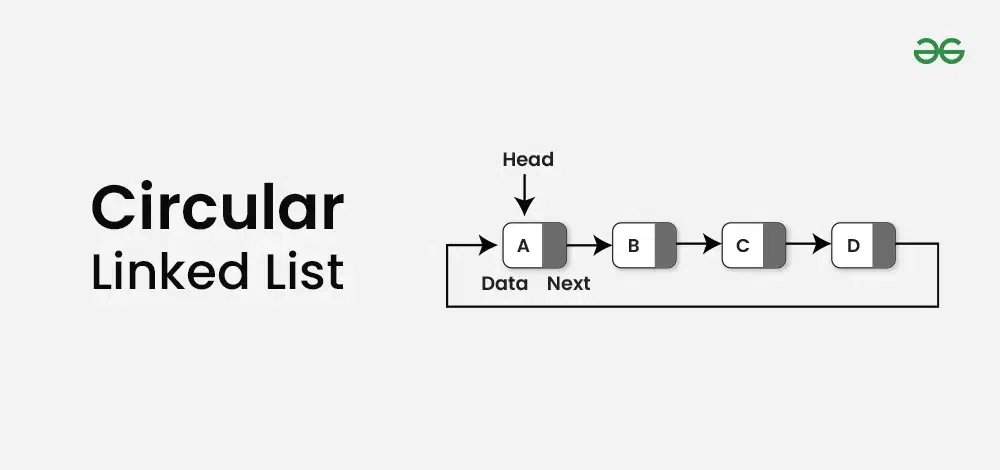

# Linked List 
* Linear data structure
* Collection of node

### 1. Single Linked List :

* A singly linked list is a linear data structure where each element is a separate object called a node.
* Each node contains two parts:
   * **Data**: Holds the value or information.
   * **Next**: A pointer/reference to the next node in the sequence.

* The last node in the list points to nullptr, indicating the end of the list.
* The head pointer stores the address of the first node in the list.

#### LikedList Creation :
```c++
class Node{
    public:
        int data;   // Linked list Data 
        Node* next; // Next Node Object pointer
    
    Node(int data){     // Constructor to set value
        this -> data = data;
        this -> next = NULL;
    }
};
```
**Create a Dynamic Node**

```c++
Node* n1 = new Node(10);
```


#### Insertion at Head:

```c++
// Function to insert a node at the beginning (head)
// Passing head by reference so that the original head pointer can be updated
void insertAtHead(Node*& head, int data) {
    // Step 1: Create a new Node with the given data
    Node* temp = new Node(data);

    // Step 2: Link the new node to the current head node
    temp->next = head;

    // Step 3: Update the head pointer to point to the new node
    head = temp;
}
```


#### Print Linked List :
```c++
// Function to print the entire linked list
void printLinkedList(Node* head) {
    // Traverse the list until the end (nullptr)
    while (head != nullptr) {
        // Print the data of the current node
        cout << head->data << " -> ";

        // Move to the next node
        head = head->next;
    }
    // Indicate the end of the list
    cout << "NULL" << endl;
}
```


#### Insert At The Tail :
```c++
void insertAtTail(Node* &tail, int data) {
    // Create a new node with the given data
    Node* newNode = new Node(data);

    // Link the current tail node to the new node
    tail->next = newNode;

    // Set the next pointer of the new node to NULL (as it will be the last node)
    newNode->next = NULL;

    // Update the tail pointer to the new node
    tail = newNode;
}
```


#### Insert At the Middle Position :
```c++
void insertAtMiddle(Node* &head, int position, int data) {
    // Create a new node with the given data
    Node* newNode = new Node(data);

    // Temporary pointer to traverse the list
    Node* temp = head;

    // Initialize count to keep track of the current position
    int count = 1;

    // Traverse the list until reaching the node just before the desired position
    while(count < position - 1) {
        temp = temp->next;
        count++;
    }

    // Point the new node to the node currently at the desired position
    newNode->next = temp->next;

    // Insert the new node by adjusting the previous node's next pointer
    temp->next = newNode;
}
```


#### Insert at Any Position :
```c++
// Function to insert a node at the beginning (head)
// Passing head by reference so that the original head pointer can be updated
void insertAtHead(Node*& head, int data) {
    // Step 1: Create a new Node with the given data
    Node* temp = new Node(data);

    // Step 2: Link the new node to the current head node
    temp->next = head;

    // Step 3: Update the head pointer to point to the new node
    head = temp;
}

// Function to insert a node at the tail (end) of the list
void insertAtTail(Node* &tail, int data) {
    // Create a new node with the given data
    Node* newNode = new Node(data);

    // Link the current tail node to the new node
    tail->next = newNode;

    // Set the next pointer of the new node to NULL (as it will be the last node)
    newNode->next = NULL;

    // Update the tail pointer to the new node
    tail = newNode;
}

// Function to insert a node at a specific position in the list
void insertAtMiddle(Node* &head, Node* &tail, int position, int data) {

    // If the position is 1, insert at the head
    if(position == 1) {
        insertAtHead(head, data);
        return;
    }

    // Create a new node with the given data
    Node* newNode = new Node(data);

    // Temporary pointer to traverse the list
    Node* temp = head;

    // Initialize count to keep track of the current position
    int count = 1;

    // Traverse the list until reaching the node just before the desired position
    while(count < position - 1) {
        temp = temp->next;
        count++;
    }

    // If the next node is NULL, it means we are inserting at the end, so use insertAtTail
    if(temp->next == NULL) {
        insertAtTail(tail, data);
        return;
    }

    // Link the new node to the node currently at the desired position
    newNode->next = temp->next;

    // Insert the new node by adjusting the previous node's next pointer
    temp->next = newNode;
}
```


#### Deletion Linked List Node :

```c++
class Node {
public:
    int data;       // Data stored in the node
    Node* next;     // Pointer to the next node in the list

    // Constructor to initialize a node with given data
    Node(int data) {
        this->data = data;       // Initialize the data
        this->next = nullptr;    // Initialize the next pointer to nullptr
    }

    // Destructor to clean up memory when a node is deleted
    ~Node() {
        // If the current node points to another node, delete it recursively
        if(this->next != nullptr) {
            delete next;
            this->next = nullptr;
        }

        // Print a message indicating which node's memory is being freed
        cout << "Memory is freed for Node with data " << this->data << endl;
    }
};
```
```c++
// Delete Node at a specific position
void deleteAtPosition(Node* &head, Node* &tail, int position) {

    // Deleting the first or head node
    if(position == 1) {
        // Store the current head node in a temporary pointer
        Node* temp = head;

        // Update the head to point to the next node
        head = head->next;

        // Free the memory of the old head node
        temp->next = NULL;
        delete temp;

        // If the list becomes empty after deletion, update the tail to nullptr
        if(head == NULL) {
            tail = NULL;
        }
    }
    // Deleting any middle or last node
    else {
        // Initialize pointers to traverse the list
        Node* current = head;
        Node* previous = NULL;

        // Traverse the list to reach the node at the given position
        int count = 1;
        while(count < position) {
            previous = current;
            current = current->next;
            count++;
        }

        // If the node to be deleted is the last node, update the tail
        if(current->next == NULL) {
            tail = previous;
        }

        // Bypass the current node to delete it from the list
        previous->next = current->next;

        // Disconnect the node from the list and free its memory
        current->next = NULL;
        delete current;
    }
}
```


### 2. Doubly Linked List :

A Doubly Linked List is a data structure where each node contains three parts:

* **Pointer to the previous node**: Points to the previous node in the sequence.
* **Data**: The actual value stored in the node.
* **Pointer to the next node**: Points to the next node in the sequence.

**Key Features:**
* **Bidirectional Traversal**: Unlike a singly linked list, you can traverse both forward and backward through the list.
* **Dynamic Size**: Nodes can be added or removed at any position dynamically.
* **No Fixed Size**: The list grows and shrinks as needed, unlike arrays.
#### Finding Linked List Length :
```c++
// Function to find the length of a linked list
int linkedListLength(Node* head){
    Node* temp = head; // Initialize a temporary pointer to traverse the list
    int count = 0; // Initialize a counter to keep track of the number of nodes

    // Traverse the linked list until the end is reached
    while (temp != NULL)
    {
        count++; // Increment the counter for each node
        temp = temp->next; // Move to the next node in the list
    }
    return count; // Return the total count of nodes
}
```


#### Insert at Head in Dubly Linked List :
```c++
// Function to insert a new node at the head of a doubly linked list
void insertAtHead(Node* &head, int data){
    Node* newNode = new Node(data); // Create a new node with the given data

    newNode->next = head; // Set the new node's next pointer to the current head
    if (head != NULL) {
        head->previous = newNode; // Set the current head's previous pointer to the new node
    }
    head = newNode; // Update the head to be the new node
}
```


#### Insert at Tail in Dubly Linked List :
```c++
// Function to insert a new node at the tail of a doubly linked list
void insertAtTail(Node* &tail, int data){
    Node* newNode = new Node(data); // Create a new node with the given data

    tail->next = newNode; // Set the current tail's next pointer to the new node
    newNode->previous = tail; // Set the new node's previous pointer to the current tail

    tail = newNode; // Update the tail to be the new node
}
```


#### Insert at Any Position in Dubly Linked List :
```c++
// Function to insert a new node at a specific position in a doubly linked list
void insertAtMiddle(Node* &head, Node* &tail, int position, int data){
    // If inserting at the head (position 1)
    if(position == 1){
        insertAtHead(head, data); // Use existing function to insert at the head
        return;
    }

    Node* temp = head; // Start from the head of the list
    int count = 1; // Initialize a counter to track the current position

    // Traverse the list to reach the node just before the desired position
    while(count < position - 1){
        temp = temp->next;
        count++;
    }

    Node* newNode = new Node(data); // Create a new node with the given data

    // Set the pointers for the new node and adjust surrounding nodes
    newNode->next = temp->next; 
    if(temp->next != NULL) { // Check if we're not inserting at the tail
        temp->next->previous = newNode;
    }
    temp->next = newNode;
    newNode->previous = temp;

    // If inserting at the last position (after the last node)
    if(newNode->next == NULL){
        insertAtTail(tail, data); // Use existing function to insert at the tail
        return;
    }
}
```


#### Delete any position in Dubly Linked List :


```c++
class Node {
    public:
    int data;          // Data stored in the node
    Node* previous;    // Pointer to the previous node in the list
    Node* next;        // Pointer to the next node in the list

    // Constructor to initialize the node with a given data value
    Node(int data) {
        this->data = data;       // Set the node's data
        this->next = NULL;       // Initialize the next pointer to NULL
        this->previous = NULL;   // Initialize the previous pointer to NULL
    }

    // Destructor to free memory and clean up the node
    ~Node() {
        cout << "Memory free for Node with Data " << this->data << endl;

        // If the node has a next node, recursively delete it
        if(next != NULL) {
            delete next;       // This will call the destructor for the next node
            next = NULL;       // Set the next pointer to NULL to avoid dangling pointers
        }
    }
};
```


```c++
// Function to delete a node from a doubly linked list at a specified position
void deleteDublyLinkedList(Node* &head, int position) {

    // Case 1: Deleting the first node (head node)
    if (position == 1) {
        Node* temp = head; // Temporary pointer to the node to be deleted

        // Update head to the next node
        head = temp->next;

        // If there is a next node, update its previous pointer to NULL
        if (head != NULL) {
            head->previous = NULL;
        }

        // Break the link of the node to be deleted
        temp->next = NULL;

        // Delete the node and free the memory
        delete temp;
    } else { 
        // Case 2: Deleting a node from a middle or last position

        Node* currentNode = head;  // Pointer to traverse the list
        Node* previousNode = NULL; // Pointer to keep track of the previous node
        int count = 1;             // Counter to find the correct position

        // Traverse the list until the desired position is reached
        while (count < position) {
            previousNode = currentNode;
            currentNode = currentNode->next;
            count++;
        }

        // Adjust the previous pointer of the current node (unlinking it from the list)
        currentNode->previous = NULL;

        // Adjust the next pointer of the previous node to bypass the node to be deleted
        previousNode->next = currentNode->next;

        // If there is a next node, update its previous pointer to link back to the previous node
        if (currentNode->next != NULL) {
            currentNode->next->previous = previousNode;
        }

        // Break the links of the node to be deleted
        currentNode->next = NULL;

        // Delete the node and free the memory
        delete currentNode;
    }
}
```


### 3. Circular Linked List :

```c++

```


```c++

```


```c++

```


```c++

```


```c++

```


```c++

```


```c++

```


```c++

```


```c++

```


```c++

```


```c++

```


```c++

```


```c++

```


```c++

```


```c++

```


```c++

```


```c++

```


```c++

```


```c++

```


```c++

```


```c++

```


```c++

```


```c++

```


```c++

```


