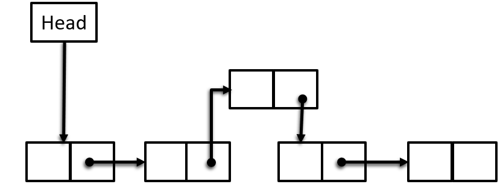

# Searching & Sorting
## Searching :

### Linear Search :
Linear search is an algorithm that sequentially checks each element of a list until the target element is found or the list ends.

#### Linear Search Time Complexity :
* Best Case: O(1) - If the target element is found at the beginning of the list.
* Average Case: O(n) - In the average case, linear search may need to check half of the elements on average.
* Worst Case: O(n) - If the target element is at the end of the list or not present in the list, linear search would have to iterate through all elements.
#### Linear Search Space Complexity :
* O(1) : Because it only requires a constant amount of additional space for storing variables like indices and loop counters. It does not require extra space proportional to the input size.

#### Linear Search Use Case :
- Unsorted data
- Small datasets
- Sequential search
- Finding the first occurrence

##### Example  :
```c++
// Function to perform linear search
int linearSearch(const vector<int>& arr, int target) {
    // Iterate through each element in the array
    for (size_t i = 0; i < arr.size(); ++i) {
        // If the current element matches the target, return its index
        if (arr[i] == target) {
            return i;
        }
    }
    // If the target is not found, return -1
    return -1;
}
```

### Binary Search :
Dividing the search interval in half, comparing the target value to the middle element, and adjusting the interval based on the comparison.

#### Binary Search Time Complexity :
* Best Case: O(1) - When the element being searched is in the middle of the array.
* Average Case: O(log n) - Binary search halves the search space in each step.
* Worst Case: O(log n)

#### Binary Search Space Complexity :
* O(1) : Because it only requires a constant amount of additional space for storing variables like indices and midpoints. It does not require extra space proportional to the input size.

#### Binary Search Use Case :
* Searching sorted arrays
##### Example :
```c++
// Finding the key index in the sorted array
int findElementInSortedArray(int arr[] , int size , int key){
    int start = 0;
    int end = size - 1;
    int mid = (start + end)/2;

    while (start <= end)
    {
        // Check the middle point is quals to key or not
        if (arr[mid] == key)
        {
            return mid;
        }
        
        // Moving right side
        if (key > arr[mid])
        {
            start = mid + 1;
        }
        // Movieng Left Side
        else if (key < arr[mid])
        {
            end = mid - 1;
        }
        mid = start + (end-start)/2;
    }
    return -1;
}
```

## Sorting :
### Selection Sort :
Selection sort is a simple comparison-based sorting algorithm that repeatedly selects the smallest (or largest, depending on the order) element from the unsorted portion of the list and swaps it with the first unsorted element, moving the boundary between the sorted and unsorted sections of the list.

#### Selection Sort Time Complexity :
* Best Case : O(n^2)
* Worst Case : O(n^2)
* Avarage Case : O(n^2)

#### Selection Sort Space Complexity :
* O(1)

#### Selection Sort Use Case :
* Small Dataset
##### Example :
```c++
void selectionSort(vector<int>& arr, int n)
{   
    for(int i = 0; i < (n-1); i++){
        int minIndex = i;

        for(int j = i+1; j < n ; j++){
            if(arr[j] < arr[minIndex]){
                minIndex = j;
            }
        }
        swap(arr[minIndex] , arr[i]);
    }
}
```

### Bubble Sort :
A simple sorting algorithm that repeatedly steps through the list, compares adjacent elements, and swaps them if they are in the wrong order.
#### Bubble Sort Time Complexity :
* Best Case: O(n) - If the list is already sorted, bubble sort will make only one pass through the list to check that it's sorted.
* Average Case: O(n^2) - In the average case, bubble sort requires nested loops to compare and swap elements, leading to quadratic time complexity.
* Worst Case: O(n^2) - If the list is sorted in reverse order, bubble sort will require the maximum number of comparisons and swaps.

#### Bubble Sort Space Complexity :
*  O(1) : Because it only requires a constant amount of additional space for storing variables like loop counters and temporary variables for swaps. It does not require extra space proportional to the input size.

#### Bubble Sort Use Case :
- Small datasets
- Basic sorting needs
- Understanding sorting algorithms

##### Example :
```c++
// Function to perform bubble sort
void bubbleSort(vector<int>& arr, int n) {
    // Traverse through all array elements
    for(int i = 1; i < n; i++) {
        // Last i elements are already in place, so the inner loop will run from 0 to n-i-1
        for(int j = 0; j < n - i; j++) {
            // Swap if the element found is greater than the next element
            if(arr[j] > arr[j+1]) {
                swap(arr[j], arr[j+1]);
            }
        }
    }
}
```
##### More Optimized Example :
```c++
void bubbleSort(vector<int>& arr, int n)
{   
    for(int i = 1; i<n ; i++){
        // Make a bool varibale 
        int swaped = false;
        for(int j = 0; j < n - i ; j++){
            if(arr[j] > arr[j+1]){
                swap(arr[j] , arr[j+1]);
                // If the array is already sorted. It will not be true.
                swaped = true;
            }
        }
        // If this is false. So this array is sorted.
        if(swaped == false){
            break;
        }
    }
}
```

### Insertion Sort :
Insertion Sort is a simple sorting algorithm that builds the final sorted array (or list) one item at a time. It is much less efficient on large lists than more advanced algorithms such as quicksort, heapsort, or merge sort.

#### Insertion Sort Time Complexity :
* Best Case: O(n) - If the list is already sorted, insertion sort will make only n-1 comparisons and no swaps.
* Average Case: O(n^2) - In the average case, each insertion takes an average of n/2 comparisons and swaps.
* Worst Case: O(n^2) - If the list is sorted in reverse order, each insertion requires shifting all previously sorted elements.

#### Insertion Sort Space Complexity :
* O(1) - Insertion sort requires a constant amount of additional space for the key element and loop counters. It does not require extra space proportional to the input size.

#### Insertion Sort Use Case :
* Small datasets
* Partially sorted arrays
* Situations where simplicity is more important than performance

```c++
// Function to perform insertion sort
void insertionSort(vector<int>& arr, int n) {
    for (int i = 1; i < n; i++) {
        int key = arr[i];
        int j = i - 1;
        // Move elements of arr[0..i-1], that are greater than key,
        // to one position ahead of their current position
        while (j >= 0 && arr[j] > key) {
            arr[j + 1] = arr[j];
            j = j - 1;
        } 
        arr[j + 1] = key;
    }
}
```

### Merge Sort :
