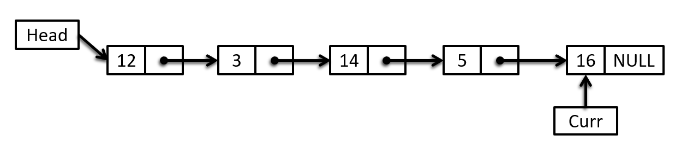

# Recursion 
* A function call itself.
* When a big problem solution in small problem multiple times then we use recurtion. Ex: 2 <sup>n</sup> , factorial(n)
* To solve recursion problem : 
    * Base case --> where function will return. (Otherwise , it will we stack overflow and will show 'Segmenta Fault')
    * Recursive relation --> To create the function.
    * Processing : Ex. increment , decrement , print etc. (it's Optional)

**Factorial Problem :**
```c++
int factorial(int n){
    // Base case :
    if(n == 0){
        return 1;
    }
    // Recursive relation :
    int ans = n * factorial(n - 1);
    return ans;
}
``` 
**Time Complexity :** O(n)

**n^power Problem :**
```c++
#include <iostream>
using namespace std;

int powerOf(int n , int power){

    // Bace Case :
    if(power == 0){
        return 1;
    }

    // Recursive relation :
    int ans = n * powerOf(n , power - 1);
    return ans;
}

int main() {
    int n , power;
    cin >> n >> power;

    int ans = powerOf(n , power);
    cout << n << " power " << power << " : " << ans << endl;
    return 0;
}
```

 
**Array Sum :**
```c++
#include <iostream>
using namespace std;

int arraySum(int *arr , int size){
    if(size == 1){
        return arr[0];
    }

    int ans = arr[0] + arraySum(arr + 1 , size - 1);
    return ans;
}

int main() {
    int arr[5] = {1,3,6,1,1};
    int size = 5;

    int ans = arraySum(arr , size);
    cout << "Sum of array : " << ans << endl;
    return 0;
}
```


### Time & Space Complixity of Recursion :
#### Factorial :
```c++

```

 

```c++

```


```c++

```

### Recurtion Tree :


Hear will be an image for recurtion tree


```c++

```


```c++

```


```c++

```


```c++

```


```c++

```


```c++

```


```c++

```


```c++

```


```c++

```


```c++

```


```c++

```


