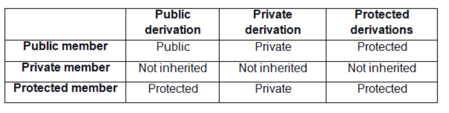

# Object Oriented Programming
**Class :** User defined data type.
**Object :** Instance of class.

#### Memory use :
* When we create a class object. The object aqure the total size of property memroy.
* But when a class have no property than is acure 1 byte.

### What is OOPs?
OOP (Object-Oriented Programming) is a programming paradigm based on the concept of "objects" which can contain data (attributes) and functions (methods). It provides a clear modular structure for programs, making it easier to maintain and modify code.
```c++
#include <iostream>
using namespace std;

// Class definition
class Car {
public:
    string brand;   // Attribute
    string model;   // Attribute
    int year;       // Attribute

    // Method (Function)
    void displayDetails() {
        cout << "Brand: " << brand << ", Model: " << model << ", Year: " << year << endl;
    }
};

int main() {
    // Creating an object of Car class
    Car car1;
    
    // Assigning values to object attributes
    car1.brand = "Toyota";
    car1.model = "Corolla";
    car1.year = 2021;
    
    // Calling method on object
    car1.displayDetails();

    return 0;
}

/* Output:
Brand: Toyota, Model: Corolla, Year: 2021
*/
```

#### Explanation:
**Class**: A blueprint for creating objects (a particular data structure), containing methods (functions) and attributes (data).
**Object**: An instance of a class. In the example, car1 is an object of the Car class.
**Attributes**: Variables defined inside a class that hold data (e.g., brand, model, year).
**Methods**: Functions defined inside a class that operate on its objects (e.g., displayDetails).

#### Access Modifiers:

**Public**: Members are accessible from outside the class.
**Private**: Members are accessible only within the class.
**Protected**: Members are accessible within the class and by derived class.


#### Getter & Setter :
Used to access and update private attributes of a class.
```c++
class Car {
private:
    string model;

public:
    // Setter
    void setModel(string m) {
        model = m;
    }

    // Getter
    string getModel() {
        return model;
    }
};

int main() {
    Car car1;
    car1.setModel("Corolla");
    cout << "Model: " << car1.getModel() << endl;
    return 0;
}

/* Output:
Model: Corolla
*/
```
#### Static vs Dynamic Allocation: 
**1. Static Allocation**
**Definition**: Memory is allocated at compile-time. The size and lifetime of the object are determined before the program runs.
**Scope**: The object is typically allocated on the stack, and its memory is automatically managed by the compiler.
**Lifetime**: The object exists until the scope in which it is defined ends.


```c++
#include <iostream>
using namespace std;

class MyClass {
public:
    int x;
    void display() {
        cout << "Value of x: " << x << endl;
    }
};

int main() {
    MyClass obj; // Static allocation
    obj.x = 10;
    obj.display(); // Output: Value of x: 10

    return 0;
}
```
**2. Dynamic Allocation**
**Definition**: Memory is allocated at runtime using the new keyword, and the size can be determined during execution.
**Scope**: The object is allocated on the heap, and the programmer is responsible for managing the memory.
**Lifetime**: The object exists until it is explicitly deallocated using the delete keyword.


```c++
#include <iostream>
using namespace std;

class MyClass {
public:
    int x;
    void display() {
        cout << "Value of x: " << x << endl;
    }
};

int main() {
    MyClass* obj = new MyClass(); // Dynamic allocation
    obj->x = 20;
    obj->display(); // Output: Value of x: 20

    delete obj; // Free the allocated memory
    return 0;
}
```
#### Constructors:

* Special functions automatically called when an object is created.
* **Default Constructor**: No parameters.
* **Parameterized Constructor**: Accepts parameters.
* **Copy Constructor**: Copies attributes from one object to another.


```c++
class Car {
public:
    string brand;
    Car(string b) {  // Parameterized Constructor
        brand = b;
    }

    Car(const Car &c) {  // Copy Constructor
        brand = c.brand;
    }
};

int main() {
    Car car1("Toyota");
    Car car2 = car1;  // Copy constructor called

    cout << "Car1 brand: " << car1.brand << endl;
    cout << "Car2 brand: " << car2.brand << endl;

    return 0;
}

/* Output:
Car1 brand: Toyota
Car2 brand: Toyota
*/
```

**Shallow Copy:**
Copies the memory address (reference) of the object’s attributes. This means if one object is modified, the changes reflect in the other object because both point to the same memory location.
**Deep Copy:**
Copies the actual value of the object’s attributes, allocating separate memory. Modifications in one object do not affect the other.


```c++
#include <iostream>
#include <cstring>
using namespace std;

class Person {
public:
    char *name;

    // Constructor
    Person(const char *n) {
        name = new char[strlen(n) + 1];
        strcpy(name, n);
    }

    // Shallow Copy Constructor (Default)
    Person(const Person &p) {
        name = p.name;
    }

    // Deep Copy Constructor (Custom)
    Person deepCopy() {
        Person temp("");
        temp.name = new char[strlen(this->name) + 1];
        strcpy(temp.name, this->name);
        return temp;
    }

    // Destructor
    ~Person() {
        delete[] name;
    }

    void display() {
        cout << "Name: " << name << endl;
    }
};

int main() {
    Person person1("John");

    // Shallow Copy
    Person person2 = person1;
    person2.name[0] = 'D';  // Modifying person2's name will affect person1

    // Deep Copy
    Person person3 = person1.deepCopy();
    person3.name[0] = 'M';  // Modifying person3's name won't affect person1

    person1.display();  // Output affected by shallow copy
    person2.display();  // Output modified by shallow copy
    person3.display();  // Output independent due to deep copy

    return 0;
}

/* Output:
Name: Doan  // Modified due to shallow copy
Name: Doan  // Reflects the change in person1
Name: Moan  // Independent due to deep copy
*/
```


#### Destructor :
* Called automatically when an object goes out of scope or is explicitly deleted.
* Used to release resources allocated to an object.
```c++
class Car {
public:
    Car() {
        cout << "Constructor called!" << endl;
    }

    ~Car() {
        cout << "Destructor called!" << endl;
    }
};

int main() {
    Car car1;  // Constructor and Destructor will be called automatically
    return 0;
}

/* Output:
Constructor called!
Destructor called!
*/
```

#### Static keyword :
**Static Variables:**
A static variable inside a function retains its value between function calls. It is initialized only once and persists throughout the program's lifetime.
**Static Functions:**
Static functions belong to the class rather than an instance of the class. They can be called without creating an object of the class.
```c++
#include <iostream>
using namespace std;

class Counter {
public:
    // Static variable
    static int count;

    // Constructor
    Counter() {
        count++;
    }

    // Static function
    static int getCount() {
        return count;
    }
};

// Initialize static variable
int Counter::count = 0;

void demoStaticVariable() {
    static int x = 0;  // Static variable
    x++;
    cout << "Static variable x = " << x << endl;
}

int main() {
    cout << "Static Variable Example:" << endl;
    demoStaticVariable();  // Output: 1
    demoStaticVariable();  // Output: 2
    demoStaticVariable();  // Output: 3

    cout << "\nStatic Functions and Variables in a Class:" << endl;
    Counter c1, c2, c3;
    cout << "Count: " << Counter::getCount() << endl;  // Output: 3

    return 0;
}

/* Output:
Static Variable Example:
Static variable x = 1
Static variable x = 2
Static variable x = 3

Static Functions and Variables in a Class:
Count: 3
*/
```

### Encapsulation :
**Encapsulation**:
* Encapsulation binds together the data (attributes) and functions (methods) that manipulate the data, while keeping both safe from outside interference and misuse. This is typically done by making data members private and providing public methods to access and modify them.

**Benefits**:
* Protects the integrity of the data by restricting direct access.
* Improves code maintainability and flexibility.
* Allows for controlled access via getter and setter methods.

```c++
#include <iostream>
using namespace std;

class BankAccount {
private:
    // Private data members
    int accountNumber;
    double balance;

public:
    // Constructor
    BankAccount(int accNum, double bal) {
        accountNumber = accNum;
        balance = bal;
    }

    // Public method to access private data (getter)
    int getAccountNumber() {
        return accountNumber;
    }

    // Public method to access and modify private data (getter and setter)
    double getBalance() {
        return balance;
    }

    void deposit(double amount) {
        if (amount > 0) {
            balance += amount;
        }
    }

    void withdraw(double amount) {
        if (amount > 0 && amount <= balance) {
            balance -= amount;
        }
    }
};

int main() {
    // Creating an object of BankAccount class
    BankAccount account(123456, 1000.0);

    // Accessing private members through public methods
    cout << "Account Number: " << account.getAccountNumber() << endl;
    cout << "Initial Balance: " << account.getBalance() << endl;

    // Modifying balance through public methods
    account.deposit(500.0);
    cout << "Balance after deposit: " << account.getBalance() << endl;

    account.withdraw(300.0);
    cout << "Balance after withdrawal: " << account.getBalance() << endl;

    return 0;
}

/* Output:
Account Number: 123456
Initial Balance: $1000
Balance after deposit: $1500
Balance after withdrawal: $1200
*/
```


### Inheritance :

**Inheritance :**
* Inheritance allows a new class (derived class) to acquire properties and behaviors (methods) of an existing class (base class).
* Promotes code reusability and hierarchical classification.

```c++
class DerivedClass : access_specifier BaseClass {
    // body of derived class
};
```
**Access Modifiers and Inheritance :**
* **Public Inheritance:** Public and protected members of the base class become public and protected members of the derived class.
* **Protected Inheritance:** Public and protected members of the base class become protected members of the derived class.
* **Private Inheritance:** Public and protected members of the base class become private members of the derived class.


**Types of Inheritance :**
* Single Inheritance
* Multi-Level Inheritance
* Multiple Inheritance
* Hierarchical Inheritance
* Hybrid Inheritance

#### Single Inheritance :
A derived class inherits from only one base class.
```c++
#include <iostream>
using namespace std;

// Base class
class Animal {
public:
    void eat() {
        cout << "Animal is eating." << endl;
    }
};

// Derived class
class Dog : public Animal {
public:
    void bark() {
        cout << "Dog is barking." << endl;
    }
};

int main() {
    Dog d;
    d.eat();  // Inherited from Animal
    d.bark(); // Defined in Dog

    return 0;
}

/*
Output:
Animal is eating.
Dog is barking.
*/
```


#### Multi-Level Inheritance :
A derived class is created from another derived class.

```c++
#include <iostream>
using namespace std;

// Base class
class Animal {
public:
    void eat() {
        cout << "Animal is eating." << endl;
    }
};

// Derived class
class Dog : public Animal {
public:
    void bark() {
        cout << "Dog is barking." << endl;
    }
};

// Derived class from Dog
class Bulldog : public Dog {
public:
    void show() {
        cout << "Bulldog is a breed of Dog." << endl;
    }
};

int main() {
    Bulldog b;
    b.eat();  // Inherited from Animal
    b.bark(); // Inherited from Dog
    b.show(); // Defined in Bulldog

    return 0;
}

/*
Output:
Animal is eating.
Dog is barking.
Bulldog is a breed of Dog.
*/
```

#### Multiple Inheritance :
A derived class inherits from more than one base class.


```c++
#include <iostream>
using namespace std;

// Base class 1
class Mammal {
public:
    void feedMilk() {
        cout << "Mammal is feeding milk." << endl;
    }
};

// Base class 2
class Bird {
public:
    void layEggs() {
        cout << "Bird is laying eggs." << endl;
    }
};

// Derived class
class Bat : public Mammal, public Bird {
public:
    void fly() {
        cout << "Bat is flying." << endl;
    }
};

int main() {
    Bat b;
    b.feedMilk(); // Inherited from Mammal
    b.layEggs();  // Inherited from Bird
    b.fly();      // Defined in Bat

    return 0;
}

/*
Output:
Mammal is feeding milk.
Bird is laying eggs.
Bat is flying.
*/
```

#### Hierarchical Inheritance
Multiple derived classes inherit from a single base class.

```c++
#include <iostream>
using namespace std;

// Base class
class Animal {
public:
    void eat() {
        cout << "Animal is eating." << endl;
    }
};

// Derived class 1
class Dog : public Animal {
public:
    void bark() {
        cout << "Dog is barking." << endl;
    }
};

// Derived class 2
class Cat : public Animal {
public:
    void meow() {
        cout << "Cat is meowing." << endl;
    }
};

int main() {
    Dog d;
    Cat c;
    d.eat();   // Inherited from Animal
    d.bark();  // Defined in Dog
    c.eat();   // Inherited from Animal
    c.meow();  // Defined in Cat

    return 0;
}

/*
Output:
Animal is eating.
Dog is barking.
Animal is eating.
Cat is meowing.
*/
```


#### Hybrid Inheritance
A combination of two or more types of inheritance
```c++
#include <iostream>
using namespace std;

// Base class
class Animal {
public:
    void eat() {
        cout << "Animal is eating." << endl;
    }
};

// Derived class 1
class Mammal : public Animal {
public:
    void breathe() {
        cout << "Mammal is breathing." << endl;
    }
};

// Derived class 2
class Bird : public Animal {
public:
    void fly() {
        cout << "Bird is flying." << endl;
    }
};

// Multiple Inheritance
class Bat : public Mammal, public Bird {
public:
    void show() {
        cout << "Bat is a flying mammal." << endl;
    }
};

int main() {
    Bat b;
    b.show();   // Defined in Bat
    b.breathe(); // Inherited from Mammal
    b.fly();    // Inherited from Bird

    return 0;
}

/*
Output:
Bat is a flying mammal.
Mammal is breathing.
Bird is flying.
*/
```
#### Inheritance Ambiguity

* Ambiguity arises in multiple inheritance when two base classes have a member with the same name.
* This can be resolved using scope resolution operator ( :: )
```c++
#include <iostream>
using namespace std;

// Base class 1
class Base1 {
public:
    void display() {
        cout << "Base1 display function." << endl;
    }
};

// Base class 2
class Base2 {
public:
    void display() {
        cout << "Base2 display function." << endl;
    }
};

// Derived class
class Derived : public Base1, public Base2 {
public:
    void show() {
        // Resolve ambiguity using scope resolution
        Base1::display(); 
        Base2::display();
    }
};

int main() {
    Derived d;
    d.show();

    return 0;
}

/*
Output:
Base1 display function.
Base2 display function.
*/
```


### Polymorphism :
**Polymorphism :**
* Polymorphism allows objects of different classes to be treated as objects of a common base class.
* It enables one interface to be used for a general class of actions, providing flexibility and reusability.
* There are two types of polymorphism:
    * **Compile-Time Polymorphism (Static Binding)**
    * **Run-Time Polymorphism (Dynamic Binding)**


#### Compile-Time  Polymorphism :
* Also known as static polymorphism or early binding.

* Achieved through function overloading and operator overloading.

* The function to be invoked is determined at compile time.

* **Function Overloading :**
    * Multiple functions can have the same name but different parameters.
    * The appropriate function is selected based on the number or type of arguments.
```c++
#include <iostream>
using namespace std;

// Function Overloading Example
class Calculator {
public:
    int add(int a, int b) {
        return a + b;
    }

    double add(double a, double b) {
        return a + b;
    }
};

int main() {
    Calculator calc;
    cout << "Sum of integers: " << calc.add(5, 10) << endl;
    cout << "Sum of doubles: " << calc.add(3.5, 4.5) << endl;

    return 0;
}

/*
Output:
Sum of integers: 15
Sum of doubles: 8
*/
```
* **Operator Overloading :**

* Allows custom implementation of operators for user-defined types.
* Example: Overloading the + operator to add two objects.
```c++
#include <iostream>
using namespace std;

// Operator Overloading Example
class Complex {
private:
    int real, imag;
public:
    Complex(int r = 0, int i = 0) : real(r), imag(i) {}

    // Overloading + operator
    Complex operator + (const Complex& obj) {
        Complex temp;
        temp.real = real + obj.real;
        temp.imag = imag + obj.imag;
        return temp;
    }

    void display() {
        cout << "Real: " << real << " Imaginary: " << imag << endl;
    }
};

int main() {
    Complex c1(10, 5), c2(2, 4);
    Complex c3 = c1 + c2; // c3 = c1.operator+(c2)
    c3.display();

    return 0;
}

/*
Output:
Real: 12 Imaginary: 9
*/
```


#### Run-Time Polymorphism

* Also known as dynamic polymorphism or late binding.

* Achieved through inheritance and virtual functions.

* The function to be invoked is determined at runtime based on the type of the object pointed to or referenced.

* **Virtual Functions**
    * A function in a base class that is overridden in a derived class.
    * The function call is resolved at runtime, allowing the correct function to be called based on the object type.
```c++
#include <iostream>
using namespace std;

// Base class
class Animal {
public:
    virtual void sound() {
        cout << "Animal makes a sound." << endl;
    }
};

// Derived class 1
class Dog : public Animal {
public:
    void sound() override {
        cout << "Dog barks." << endl;
    }
};

// Derived class 2
class Cat : public Animal {
public:
    void sound() override {
        cout << "Cat meows." << endl;
    }
};

int main() {
    Animal* a;
    Dog d;
    Cat c;

    // Base class pointer pointing to derived class objects
    a = &d;
    a->sound(); // Calls Dog's sound() function

    a = &c;
    a->sound(); // Calls Cat's sound() function

    return 0;
}

/*
Output:
Dog barks.
Cat meows.
*/
```


#### Abstraction :
**Abstraction**

* Abstraction is the concept of hiding the complex implementation details and showing only the essential features of an object.
* It allows focusing on what an object does rather than how it does it.
* In C++, abstraction can be achieved using abstract classes and interfaces (pure virtual functions).

**Abstract Class**

* An abstract class is a class that cannot be instantiated directly.
* It is created using at least one pure virtual function.
* A pure virtual function is declared by assigning 0 to it within the base class.
* Derived classes must override the pure virtual functions of the base class.

**Implementation of Abstraction**

* The base class provides the general interface, while derived classes provide specific implementations.


```c++
#include <iostream>
using namespace std;

// Abstract Base Class
class Shape {
public:
    // Pure virtual function
    virtual void draw() = 0;
};

// Derived class 1
class Circle : public Shape {
public:
    void draw() override {
        cout << "Drawing Circle" << endl;
    }
};

// Derived class 2
class Rectangle : public Shape {
public:
    void draw() override {
        cout << "Drawing Rectangle" << endl;
    }
};

int main() {
    Shape* shape1 = new Circle();     // Base class pointer pointing to derived class object
    Shape* shape2 = new Rectangle();  // Base class pointer pointing to derived class object

    shape1->draw();  // Calls Circle's draw() function
    shape2->draw();  // Calls Rectangle's draw() function

    delete shape1;
    delete shape2;

    return 0;
}

/*
Output:
Drawing Circle
Drawing Rectangle
*/
```
* Abstract classes are used when you want to create a base class that represents a general concept, while the derived classes provide specific implementations.
* Abstraction helps to reduce complexity by hiding unnecessary details from the user and exposing only the essential functionalities.

